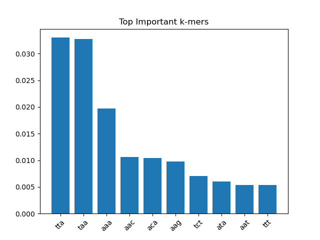

# 🧬 AI-Based DNA Sequence Analysis for Disease Pattern Detection

## 📌 Overview

This project explores the application of machine learning techniques to analyze human DNA sequences and identify patterns associated with disease-related genes.

Using k-mer feature extraction and ensemble learning, the model aims to distinguish between genes linked to diseases and more stable “housekeeping” genes.

## 🎯 Motivation

Understanding patterns in genomic sequences is critical for early disease detection and biomedical research.

This project was inspired by my interest in biomedical engineering, combining:

- biology
- data science
- machine learning

## 🧪 Methodology

1. Data Collection
Real DNA sequences were obtained from NCBI.
Genes used:
- Disease-related: BRCA1, TP53, EGFR
- Normal: GAPDH, ACTB

2. Feature Engineering
- k-mer frequency extraction (k = 3-4)
- normalization by sequence length
- GC-content and AT-content

3. Model
- Random Forest Classifier
- Stratified cross-validation
- Class balancing applied

## 📊 Results

- Accuracy: ~0.86
- ROC-AUC: ~0.96
- Balanced performance across classes
 
The model successfully avoided bias caused by class imbalance and demonstrated meaningful predictive capability.

### 📈 Results Interpretation

While initial results showed high accuracy (~0.98), further analysis revealed severe class imbalance.

After applying balancing techniques, the model achieved more realistic performance (~0.86 accuracy) with significantly improved recall for minority classes.

This highlights the importance of proper dataset handling in biomedical machine learning applications.

## 🔬 Key Insights

- Certain k-mers (e.g., AT-rich patterns) were highly influential
- This suggests biologically relevant sequence structures
- Feature importance analysis enables interpretability

### 🧬 Biological Insights

The model identified several AT-rich k-mers (e.g., TTA, TAA, AAA) as highly influential features.

This may indicate that certain nucleotide compositions play a role in distinguishing genomic regions, which aligns with known biological patterns such as AT-rich domains.

Further research is required to validate these findings biologically.

## ⚠️ Challenges

- Severe class imbalance in real genomic data
- Need for careful preprocessing and validation
- Avoiding overfitting

## 📊 Model Evaluation

Confusion Matrix:
[[21, 1],
 [5, 17]]

This shows strong performance on both classes, with slightly lower recall for disease-related genes.

### ⚠️ Limitations

- The dataset is limited to a small number of genes  
- Labels are gene-level, not mutation-level  
- No experimental biological validation  

Future work will address these limitations with larger datasets and more precise annotations.

## 🔬 Experimental Design

To ensure scientific validity, the dataset was constructed using real DNA sequences from multiple genes. 

Sequences were segmented into fixed-length fragments (200 bp) to create a sufficiently large dataset. 

To address class imbalance, resampling techniques and stratified validation were applied.

Multiple evaluation metrics (accuracy, F1-score, ROC-AUC) were used to assess model performance.

## 🚀 Future Work

- Deep learning models (CNN for DNA sequences)
- Larger genomic datasets
- Integration with real clinical data
- Mutation-level prediction

### 🌍 Future Vision

My long-term goal is to apply machine learning and computational methods to improve human health through biomedical engineering, particularly in genetics and disease prediction.

## 💡 Personal note

This project reflects my long-term goal of contributing to biomedical innovation by combining computational methods with biological understanding.

## 🧠 Conclusion

This project demonstrates how machine learning can be applied to real biological data to extract meaningful patterns, bridging the gap between computational methods and biomedical research.

# 👤 Author

Aspiring Biomedical Engineer focused on applying AI to genetics and human health.
